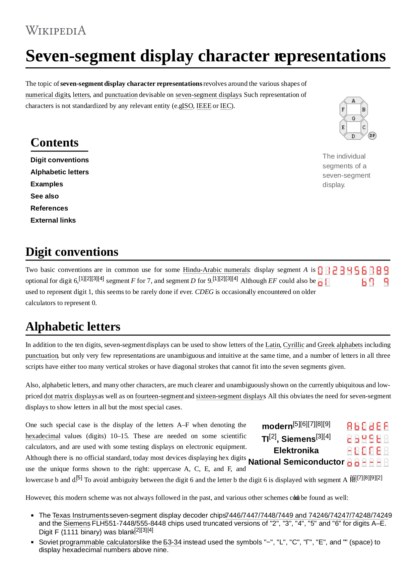

# Seven-segment display character representations via JavaScript

<object data="sevn.pdf" type="application/pdf" width="700px" height="700px">
    <embed src="sevn.pdf">
        
This browser does not support PDFs. Please download the PDF to view it: <a href="sevn.pdf">Download PDF</a>.

    </embed>
</object>